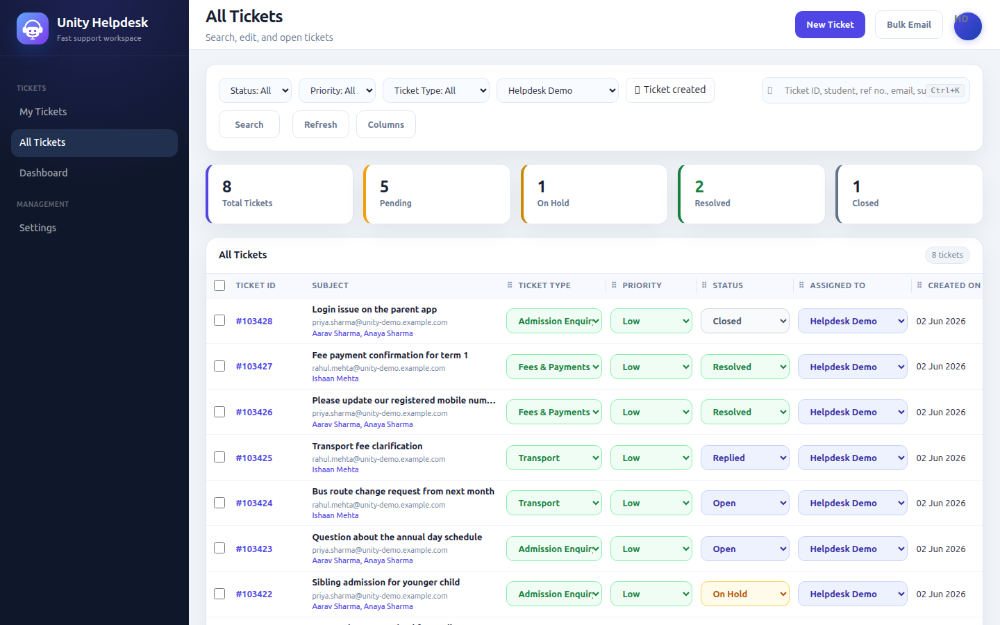

<div align="center">

# 🎧 Unity Helpdesk

**A modern, open-source support desk built on [Frappe Helpdesk](https://github.com/frappe/helpdesk) — streamlined for high-volume teams (and schools).**

[](LICENSE)
&nbsp;Forked from [frappe/helpdesk](https://github.com/frappe/helpdesk) · forward-ported to Helpdesk **v1.24 / Frappe v15**

</div>

---

## What it is

Unity Helpdesk is an open-source fork of **Frappe Helpdesk** that adds a fast, focused **single-page agent workspace** plus features built for support teams handling **tens of thousands of tickets** — and optional, first-class integration with the **[Frappe Education](https://github.com/frappe/education)** module (student / guardian context on every ticket).

It installs as a standard Frappe app and is fully self-hostable.

## ✨ Key features (on top of Frappe Helpdesk)

- **Unity SPA** — a lightweight, keyboard-friendly agent workspace at `/unity-helpdesk` (ticket list, detail, dashboard, profile, users).
- **Advanced search** — FULLTEXT + denormalized fields to search by ticket, subject, message body, and (optionally) student / guardian.
- **Saved-reply templates** — categories, multi-language, and Jinja rendering, surfaced in the reply editor.
- **Bulk email** — send to many recipients with a single audited ticket and asymmetric BCC.
- **Ticket-type auto-assign** — route a ticket to a type by keyword match on its subject / body.
- **Performance** — targeted DB indexes, request-scoped caching, Redis-cached dashboard aggregates (load-tested to 500 concurrent users — see [`loadtest/`](loadtest/)).
- **Optional education integration** — student / guardian / fees context on tickets when the Education app is installed; degrades gracefully without it.

## 📸 Screenshots

| Ticket list | Dashboard |
| --- | --- |
|  |  |

| Saved-reply settings | Student context on a ticket |
| --- | --- |
|  |  |

## 🚀 Install

Requires a [Frappe Bench](https://github.com/frappe/bench) running **Frappe v15**.

```bash
cd $PATH_TO_YOUR_BENCH
bench get-app https://github.com/UnityAppSuite/unity-helpdesk --branch unity-helpdesk-latest
bench --site <your-site> install-app helpdesk
bench --site <your-site> migrate
```

Open **`/unity-helpdesk`** to start. To make it the default landing UI, set **HD Settings → Helpdesk UI = "Unity Helpdesk"**.

## 📚 Documentation

| Guide | For |
| --- | --- |
| [Configuration](docs/configuration.md) | Admins — settings, UI switch, reminders |
| [Bulk email](docs/bulk-email.md) | Agents/admins — bulk sends + audit |
| [Performance](docs/performance.md) | Developers — indexes, caching, benchmarks |
| [Education integration](docs/education-integration.md) | Optional student/guardian context |

## 🛠️ Built on Frappe Helpdesk

Unity Helpdesk is a fork of [frappe/helpdesk](https://github.com/frappe/helpdesk) (AGPL-3.0), forward-ported onto the current stable release. We contribute generic improvements back upstream — see our [pull requests to Frappe Helpdesk](https://github.com/frappe/helpdesk/pulls?q=is%3Apr+author%3Aankitpatil-ap).

## 📄 License

[AGPL-3.0](LICENSE) — same as upstream Frappe Helpdesk.

---

<div align="center"><sub>Unity Helpdesk · maintained by <b>UnityAppSuite</b> · built on the Frappe Framework</sub></div>
