# Unity Helpdesk — Features & Workflows (Non-Technical Guide)

**Project:** Walnut School — Unity Helpdesk
**Audience:** Support staff, administrators, school leadership, trainers
**Companion document:** `UNITY_HELPDESK_TECHNICAL.md` (for developers)

---

## 1. What is Unity Helpdesk?

Unity Helpdesk is Walnut's support system for handling questions and requests from
**parents and guardians**. It is built on top of a popular open-source help-desk product
(Frappe Helpdesk) but customised for a **school**, where almost every request is about a
**student** and usually involves **fees, classes, or admissions**.

In simple terms:

- A parent emails support (or staff create a request) → a **ticket** is created.
- The ticket lands in front of a support **agent**, who automatically sees **which student
  and family** it belongs to.
- The agent replies, reassigns, puts it on hold, or closes it — all from one fast screen.

You open it in your browser at **`/unity-helpdesk`**.

---

## 2. Who uses it (roles)

| Role | What they can do |
|------|------------------|
| **Agent / Helpdesk User** | View and handle tickets — reply, add notes, assign, put on hold, resolve, close. |
| **Admin / Super Admin** | Everything an agent can do, **plus** manage agents, ticket types & colours, reply templates, settings, **send bulk emails**, and see the **full dashboard**. |
| **Parent / Guardian** | Does **not** use this screen. They interact by **email** — their messages become tickets and their replies re-open tickets automatically. |

What you can see and do is controlled by your role — menu items and buttons appear only if
you have permission.

---

## 3. The overall journey (at a glance)

```
Parent emails / staff creates a request
        │
        ▼
   TICKET CREATED  ──►  auto-sorted by TYPE + PRIORITY, response clock (SLA) starts,
        │                routed to a TEAM / AGENT
        ▼
   AGENT OPENS IT  ──►  instantly sees STUDENT + GUARDIAN context
        │
        ▼
   AGENT WORKS IT  ──►  reply to parent · internal note · put on hold · reassign
        │
        ▼
   PARENT REPLIES  ──►  ticket re-opens automatically, conversation continues
        │
        ▼
   RESOLVED / CLOSED  ──►  shows in the DASHBOARD trends
```

---

## 4. Features — each explained with its flow

### 4.1 Ticket List (My Tickets / All Tickets)

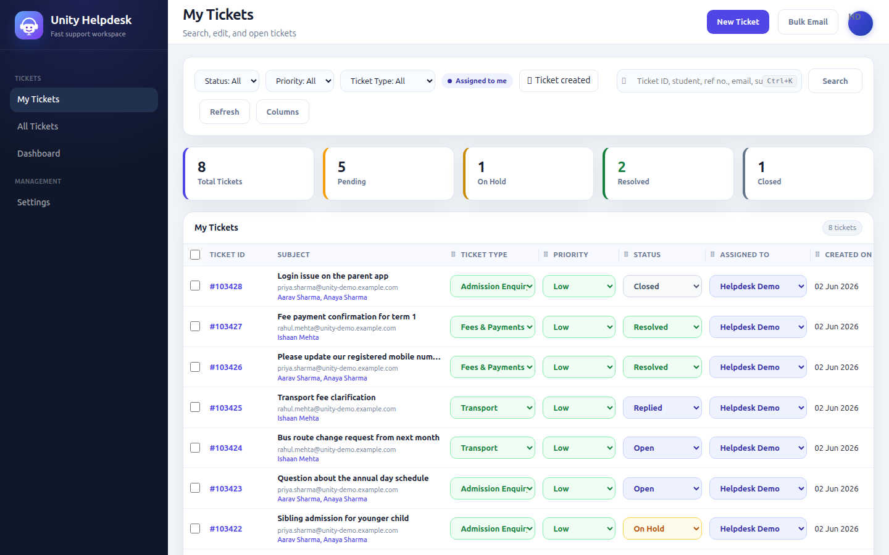

**What it is:** the main working screen — a table of tickets you can filter, search, sort,
and act on. "My Tickets" shows tickets assigned to you; "All Tickets" shows everything (for
those with permission).

| My Tickets                                          | All Tickets                                             |
| --------------------------------------------------- | ------------------------------------------------------- |
| 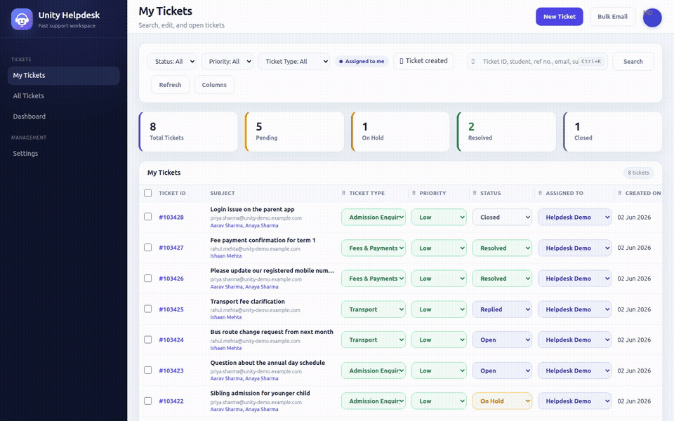 |  |

**Flow:**
1. Open **My Tickets** or **All Tickets** from the sidebar.
2. Five summary cards at the top show **Total / Pending / On Hold / Resolved / Closed**.
3. Use the filter bar — **Status, Priority, Ticket Type, Assigned To, Date Range**.
4. Click any row to open the ticket.

**Good to know:** tickets created from the school's own screens get a subtle **green tint**
so you can tell them apart from emailed-in tickets. A skeleton loader shows briefly while
data loads.

---

### 4.2 Search (education-aware & family-aware)

**What it is:** one search box that finds tickets by almost anything meaningful in a school
context.

| By student reference number                          | By guardian email (family-aware)                              | By email-body content                                  |
| ---------------------------------------------------- | ------------------------------------------------------------- | ------------------------------------------------------ |
| 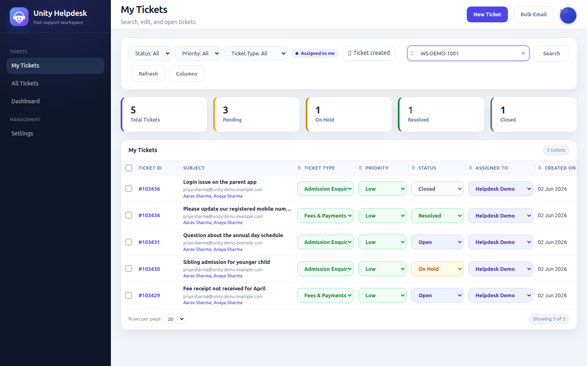          | 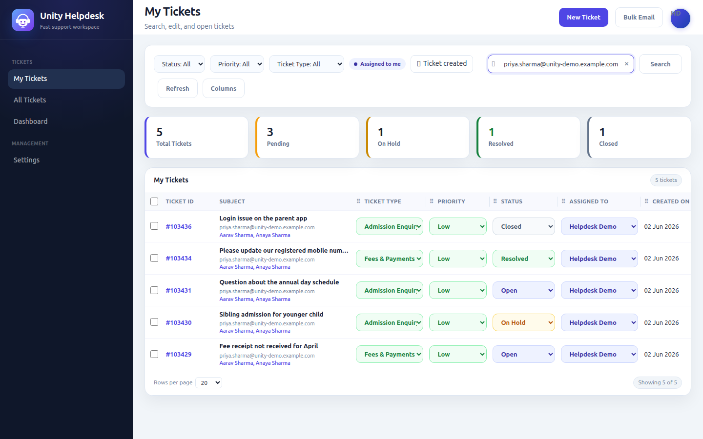       | 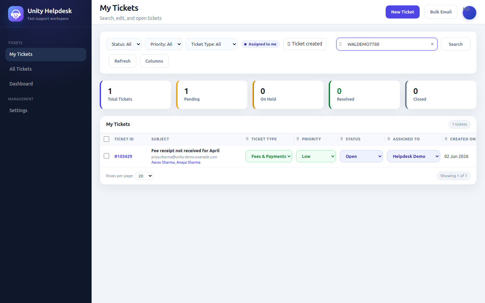        |
| 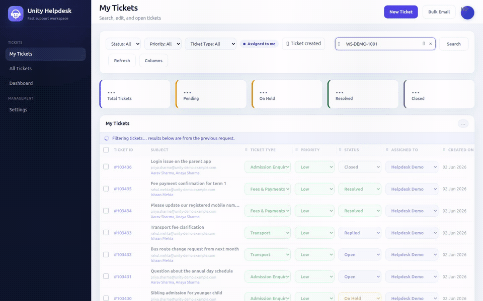 |  | 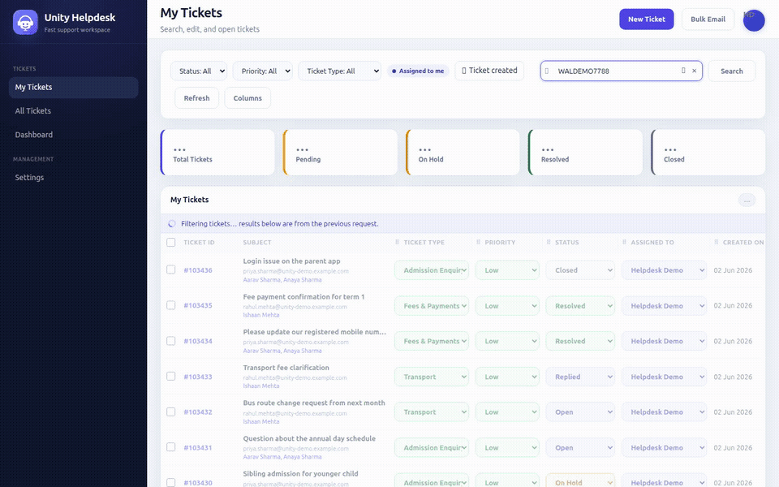 |

- **Student reference number** (e.g. `WS-DEMO-1001`) → all of that student's family tickets.
- **Guardian email** → **every child's** tickets (family-aware), not just one.
- **Email body content** (e.g. a payment reference quoted in the message) → the exact ticket
  whose body contains it, even when the term appears nowhere in the subject.

**You can search by:**
- Ticket ID
- **Student name**
- **Student reference number**
- **Parent / guardian email**
- Subject line
- **Anything written in the email body**

**Flow:**
1. Click the search box (or press **Ctrl+K**).
2. Recent searches appear instantly; start typing and **live suggestions** drop down.
3. Use ↑ / ↓ to move, **Enter** to pick, **Esc** to close.
4. Results are **ranked** so the most relevant ticket is at the top.

**The clever part — "family-aware":** if you search a **parent's email**, it finds tickets
for **all of that parent's children**, not just one — because the system knows the family
relationships. Exact ticket IDs and student reference numbers always jump to the top.

---

### 4.3 Student & Guardian Context Panel

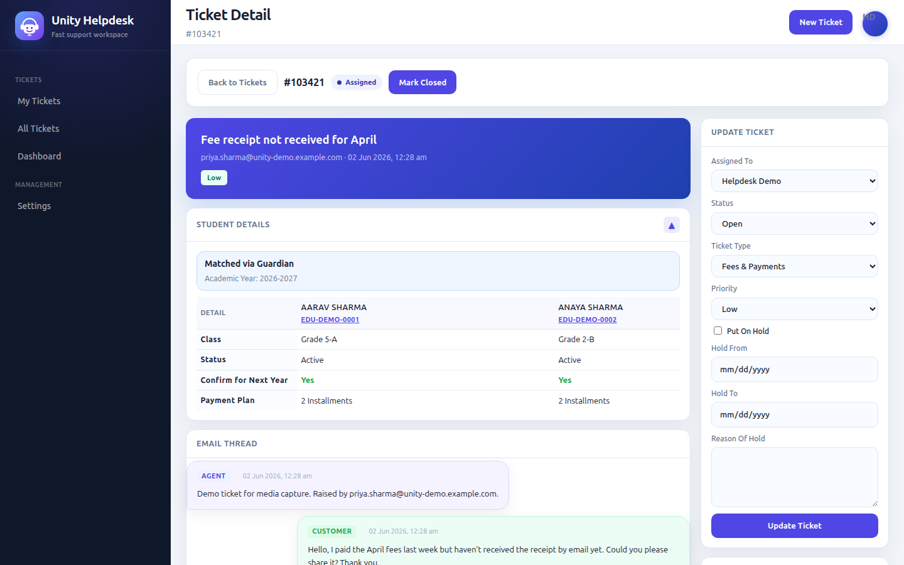

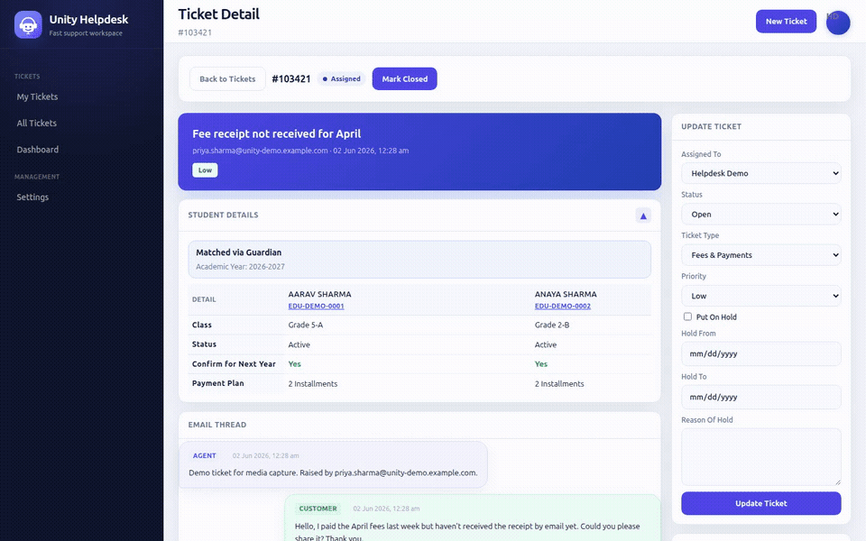

**What it is:** the standout school feature. On every ticket, the system automatically shows
**who the student is and their full family/school context** — no manual lookup in another
system.

**It shows:**
- The **student(s)** — name, ID, class/role
- **Guardians** — name, mobile (and alternate), email
- **Siblings**
- **Fees** and **payment schedule**
- **School location** / academic year
- A colour-coded banner (green = matched cleanly, red = needs attention)

**Flow:**
1. Open a ticket.
2. The context panel loads **alongside** the conversation (in parallel, so it never slows
   down reading the email).
3. Expand/collapse the section as needed.

**Why it matters:** an agent reading "my fees aren't showing" immediately sees the child,
the class, the guardians to call, and the fee status — without leaving the ticket.

---

### 4.4 Reading the Conversation (two thread layouts)

**What it is:** the email thread on a ticket can be read in two styles, set per user.

- **Classic** — a chronological log of messages.
- **Chat-Based** — chat-style bubbles (agent on one side, parent on the other; internal
  notes shown distinctly).

**Flow:**
1. Go to **Settings → Unity Settings → Email Thread Layout**.
2. Choose **Classic** or **Chat Based** and save.
3. Every ticket now uses your chosen style.

Sent (agent), Received (parent), and internal notes are visually distinct, with timestamps,
recipients, and attachment links.

---

### 4.5 Replying & Internal Notes

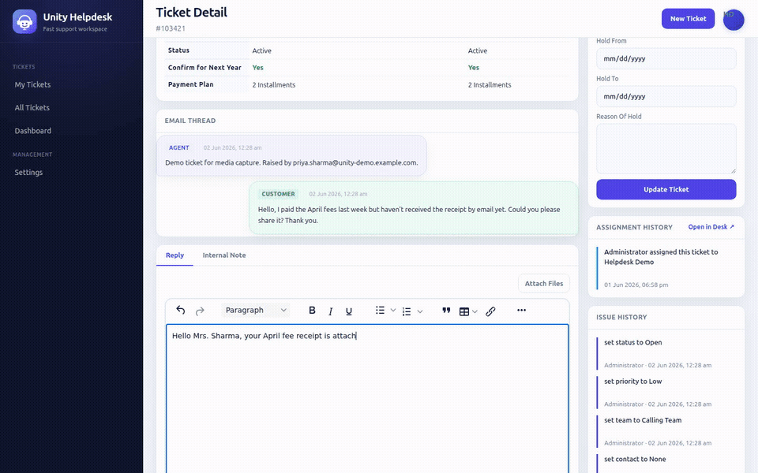

**What it is:** the way agents respond on a ticket.

- **Reply** — goes to the parent as an email.
- **Internal Note** — visible only to staff (for collaboration); never emailed.

**Flow:**
1. Open a ticket and scroll to the compose box.
2. Choose the **Reply** tab or the **Internal Note** tab.
3. Write using the rich-text editor; attach files if needed.
4. Send.
   - A **reply** emails the parent and marks the ticket as **Replied**.
   - When the **parent replies back**, the ticket automatically **re-opens** so it returns
     to your queue.

---

### 4.6 Updating a Ticket (assign, status, type, priority)

**What it is:** the sidebar controls for changing a single ticket.

**Flow:**
1. Open a ticket.
2. In the right sidebar, change **Assigned To**, **Status**, **Ticket Type**, or
   **Priority**.
3. The change saves and is recorded in the ticket's **Assignment History** / activity trail.

---

### 4.7 On-Hold Workflow

**What it is:** a way to park a ticket that's waiting on something (e.g. parent response or
fees clearance) — tracked separately from its status.

**Flow:**
1. Open a ticket.
2. In the sidebar, tick **On Hold**.
3. Set a **From** and **To** date and write a **reason**.
4. The ticket is marked on-hold and appears in the **On Hold** counters and filters.

This keeps your "Pending" numbers honest — things genuinely waiting on someone else are
separated out.

---

### 4.8 Bulk Actions on the List

**What it is:** change many tickets at once instead of one by one.

**Flow:**
1. In the ticket list, tick the checkboxes for the tickets you want (or select all on the
   page).
2. A bulk-action bar appears.
3. Choose the field to change — **Status, Priority, Assignee, Ticket Type, or Team**.
4. Apply; a **progress bar** shows it working through the selected tickets.

---

### 4.9 Customisable Columns

**What it is:** tailor the ticket table to how you work.

**Flow:**
1. Open the column-settings option on the ticket list.
2. **Show/hide** columns, **drag to reorder**, and **resize** widths.
3. Your layout is **saved to your profile**, so it's the same next time you log in.

---

### 4.10 Bulk Email to Parents

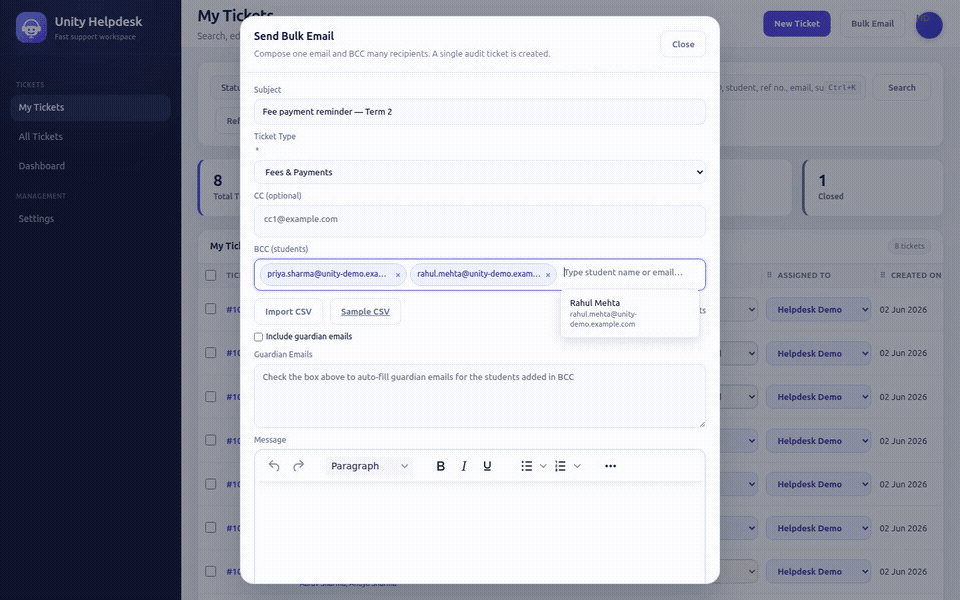

**What it is:** send one email to many parents/guardians — for example, all parents of a
class — with a full audit trail.

**Flow:**
1. Click **Bulk Email** in the top bar (admins / all-ticket users).
2. Choose a **Ticket Type** (required) and write your message in the editor.
3. Add recipients by:
   - typing/pasting addresses,
   - **importing a CSV** (a sample template is downloadable),
   - and optionally ticking **Include Guardians**, which auto-adds the guardian emails for
     the students you've listed (with a note of any it couldn't match).
4. Add CC / BCC and attachments if needed.
5. Send.

**Behind the scenes (in plain words):** the system sends **one** email to everyone (parents
**don't** see each other's addresses), and it **records the whole send as a special ticket**
so you can always prove who received what. If a parent **replies** to a bulk email, their
reply is automatically **linked back** to the original send.

**Limits:** up to 1,000 recipients (1,500 total addresses including CC/BCC) per send.

---

### 4.11 New Ticket (created by staff)

**What it is:** staff can raise a ticket on a parent's behalf.

**Flow:**
1. Click **New Ticket** in the top bar.
2. Enter the **parent's email** (with suggestions as you type), **subject**, **ticket
   type**, **priority**, and optionally **assign** it to an agent.
3. Write the first message and attach files if needed.
4. Create — you're taken straight to the new ticket. If the message should email the parent,
   it can do so.

---

### 4.12 Dashboard (analytics)

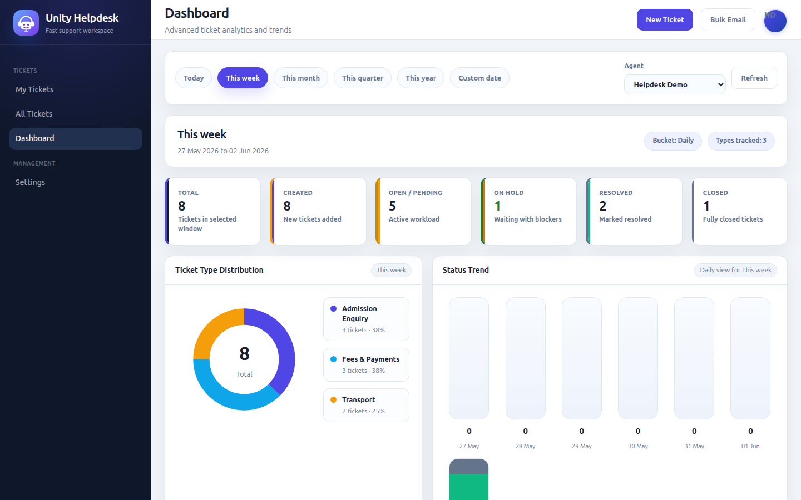

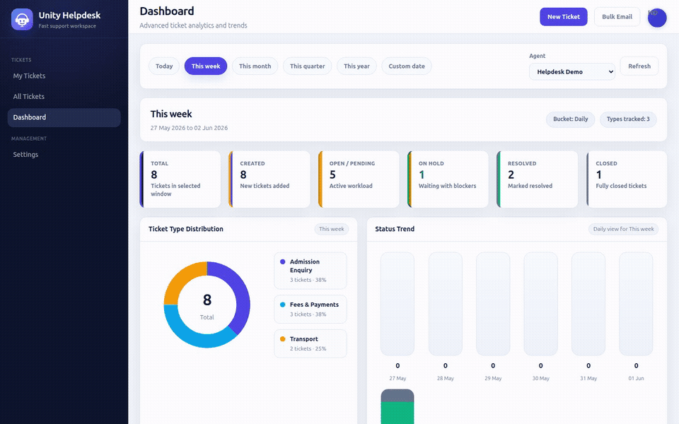

**What it is:** the manager's overview of support activity.

**It shows:**
- **KPI cards:** Total, Created, Pending, On Hold, Resolved, Closed.
- A **donut chart** of tickets by **type**.
- A **stacked bar chart** of the **status trend** over time.

**Flow:**
1. Open **Dashboard** from the sidebar.
2. Pick a date range — **Today, This Week, This Month, This Quarter, This Year, or Custom**.
3. Optionally filter to a **single agent**.
4. Numbers and charts update for that range.

The cards load almost instantly because recent results are briefly cached; you may see a "…"
placeholder for a split second while fresh numbers arrive.

---

### 4.13 Previous Tickets & Bulk-Email History (on a ticket)

**What it is:** context about the family's past interactions, shown on the ticket.

**Flow:**
1. Open a ticket.
2. Expand **Previous Ticket Details** to see earlier tickets for the same family — with a
   date filter, links, type colour dots, and tags like **"Sent"** (a bulk email) or
   **"Reply"** (a reply to a bulk email).
3. If this ticket *is* a bulk-email reply, a banner links you to the original send.

---

### 4.14 Ticket Types — Colours & Keywords (admin)

**What it is:** how tickets are categorised and visually scanned.

**Flow (admin, in Settings):**
1. Create a **Ticket Type** with a name, default priority, and description.
2. Give it a **colour** — so it's instantly recognisable in lists and charts.
3. Add **keywords** — when an incoming ticket's text contains those words, it's
   **auto-classified** to this type.

---

### 4.15 Reply Templates / Canned Responses (admin)

**What it is:** pre-written replies for common questions, to keep answers fast and
consistent.

**Flow (admin, in Settings):**
1. Create **categories** to organise templates.
2. Create **templates** — including in **English, Hindi, or Marathi** — and mark them active.
3. Agents pick a template while replying instead of typing from scratch.

---

### 4.16 Agent Management (admin)

**What it is:** managing who can work in the helpdesk.

**Flow (admin):**
1. Open the **Users / Agents** area.
2. Search existing agents (see their role and active/inactive status).
3. **Add Agent** — pick an eligible user and grant them agent access.

---

### 4.17 Settings & Profile


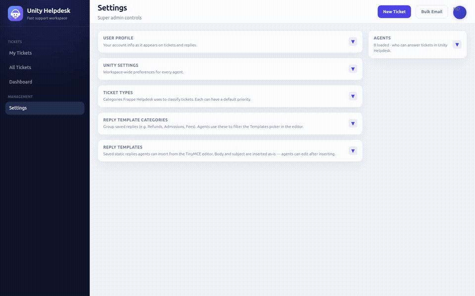

**What it is:** your personal preferences and admin configuration in one place.

**Flow:**
1. Open **Settings**.
2. See your **profile** (name, username, email).
3. Set your **Email Thread Layout** (Classic / Chat).
4. Admins additionally manage **ticket types**, **reply templates**, and **Unity settings**
   here.

---

## 5. The ticket lifecycle (status meanings)

| Status | Meaning |
|--------|---------|
| **Open** | New or re-opened — needs attention. |
| **Replied** | An agent has responded; waiting on the parent. |
| **On Hold** | Parked, waiting on something (tracked with dates + reason). |
| **Resolved** | The issue has been addressed. |
| **Closed** | Finished and locked. |

A parent replying to a "Replied" ticket automatically moves it back to **Open**, so nothing
slips through the cracks. Every change is recorded in the ticket's activity history.

---

## 6. What makes Unity Helpdesk different (and better)

Compared with the standard, out-of-the-box help-desk:

| Area | Standard product | Unity Helpdesk (ours) |
|------|------------------|------------------------|
| **Student/family awareness** | None | Automatic student, guardian, siblings, fees & class context on every ticket |
| **Search** | Basic | Search by student name, reference no., guardian email, or message body — and **family-aware** |
| **Bulk email to parents** | Not built in | Full composer with CSV import, guardian auto-add, and a complete audit trail |
| **Dashboard** | Basic cards | Date-range KPIs, per-agent filter, donut + status-trend charts |
| **On-hold** | Status only | Dedicated on-hold with dates and reason |
| **Bulk actions** | One ticket at a time | Update many tickets at once with a progress bar |
| **Ticket list** | Fixed | Show/hide, reorder & resize columns, saved per user |
| **Conversation view** | One style | Choose Classic or Chat-Based |
| **Speed at scale** | Slows with volume | Tuned for tens of thousands of tickets — fast lists, fast search, cached dashboards |

---

## 7. Tips & shortcuts

- **Ctrl+K** — jump straight to search.
- Searching a **parent's email** surfaces **all their children's** tickets.
- Use **On Hold** (not just "Pending") for things genuinely waiting on someone else — it
  keeps your numbers accurate.
- **Internal Notes** are never emailed to parents — use them freely for staff coordination.
- Set your preferred **thread layout** once in Settings; it applies everywhere.

---

*Unity Helpdesk — Walnut School. For implementation details see
`UNITY_HELPDESK_TECHNICAL.md`.*
